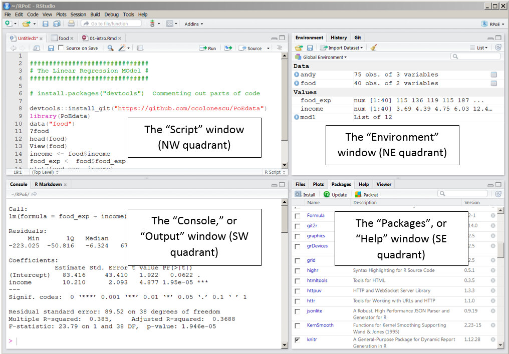
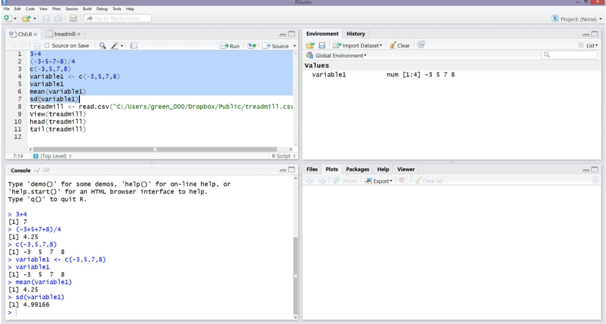
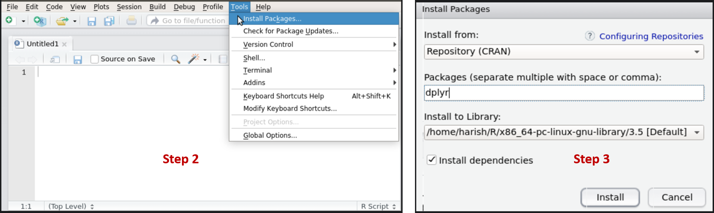
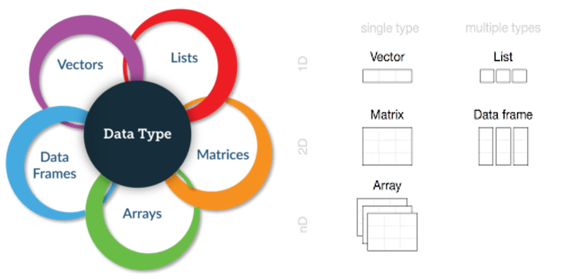
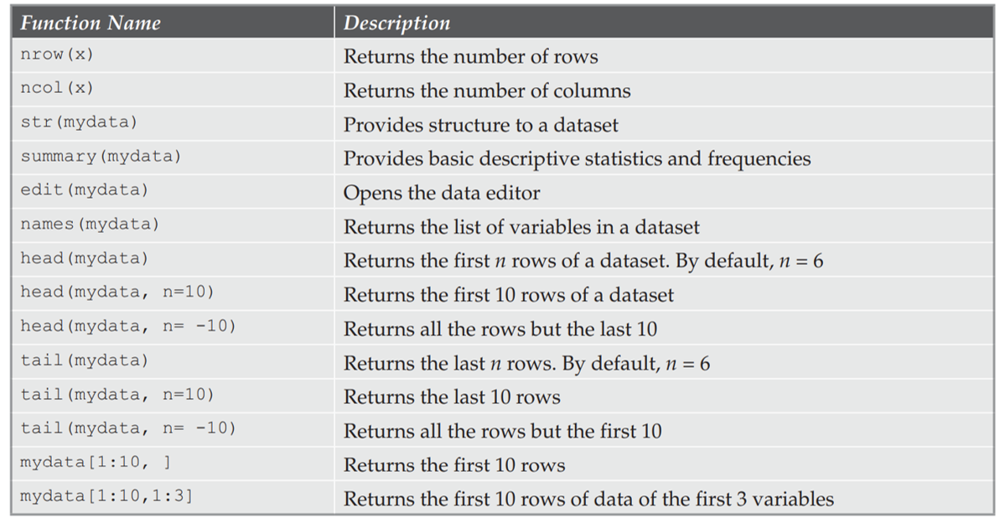
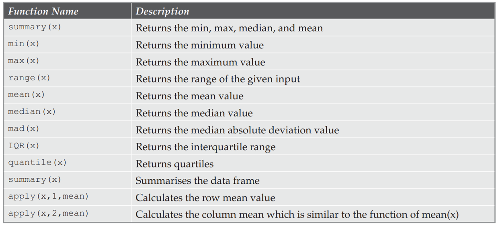
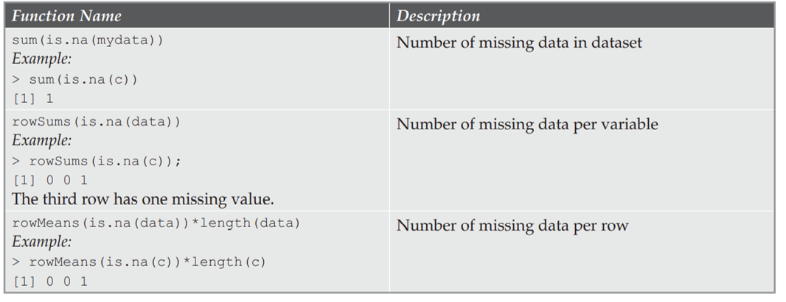
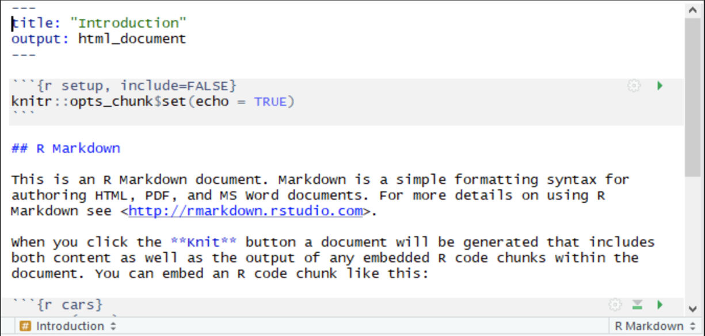

```{r xaringan-themer, include=FALSE, warning=FALSE}
library(xaringanthemer)
style_mono_accent(
  base_color = "#387490",
  header_font_google = google_font("Shadows into Light"),
  text_font_google   = google_font("Montserrat", "300", "300i"),
  code_font_google   = google_font("Monaco")
)
```


```{r setup, include=FALSE}
options(htmltools.dir.version = FALSE)
library(ggplot2)

thm <- theme_bw() + 
  theme(
    panel.background = element_rect(fill = "transparent", colour = NA), 
    plot.background = element_rect(fill = "transparent", colour = NA),
    legend.background = element_rect(fill = "transparent", colour = NA),
    legend.key = element_rect(fill = "transparent", colour = NA)
  )
theme_set(thm)
```


<style type="text/css">

body, td {
   font-size: 20px;
}
code.r{
  font-size: 15px;
}
pre {
  font-size: 20px
}
</style>


# Introduction to Software

## Topics 

- Introduction to R & RStudio
- Getting Started
  - Installing R & RStudio
  - Understanding your Working Environment
- Installing R Packages and Managing Package Dependencies
- R Data Types, Import & Export Data in R 
  <!-- - Getting Data into R  -->
    <!-- - Internal Data -->
    <!-- - External Data -->
    <!-- - Base Data -->
  <!-- - Data Export -->
- Introduction to R Programming
- Data Manipulation 
- Data Visualization
- Data Preprocessing
- Exploratory Data Analysis
- Making Reports with RMarkdown

---

## Introduction to R & RStudio

### R

- Free, $\color{red}{\text{open-source}}$, modern, and versatile statistical software.
- Programming environment for statistical computing and graphics.
- Developed by statisticians as a tool for data analysis. 
  - Currently the best tool for data analysis. 
- Designed to perform mathematical operations on vectors & matrices.
- Facilitates rapid development of new tools based on user demand. 
  <!-- - These tools are distributed as $\color{red}{\text{packages}}$. -->

<!-- ### Why R? -->

<!-- 1. Free and open-source. -->
<!-- 2. Free online books to learn R - Larger online community -->
<!-- 3. Easily create data analysis reports with R Markdown -->
<!-- 4. Many specialized packages with analysis tools than any other software. -->

<!-- **Note:** -->

<!-- 1. Quite difficult to master than other statistical software. -->
<!-- 2. Require frequent updates - require maintenance. -->


### RStudio

- RStudio is an integrated development environment, or IDE, for R programming.
- While R is an open source language, RStudio is a commercial product designed to make using R easier.
  - There  is an open source version of RStudio that is available for free.
- Before installing RStudio, R must first be installed.
- It allows users to seamlessly import CSV, Excel, text (txt), SAS (`*.sas7bdat`), SPSS (`*.sav`), and Stata (`*.dta`) files into R without having to write the code to do so.

---

## Getting Started

### Installing R & RStudio

- To install R and RStudio on any computer, download the software from their associated websites.
  - Click $\Rightarrow$ [The R Project for Statistical Computing](https://www.r-project.org/).
  - Click $\Rightarrow$ [RStudio](https://rstudio.com/products/rstudio/download/#download).
- RStudio Cloud is a hosted version of RStudio in the cloud.
  - Click $\Rightarrow$ [RStudio Cloud](https://rstudio.cloud/).

---

### Understanding your Working Environment

<center></center>

---

### Variable & Assignment Operator

<center></center>

---

## Installing R Packages and Managing Package Dependencies

- Packages are collection of functions and datasets that add new features to R.
- Most R packages are available from `CRAN`, the official R repository.
  - `CRAN` is a network of servers (called mirrors) around the world.
- Packages on CRAN are checked before they are published, to make sure they don’t contain malicious components. 

### Installing R packages from the Terminal

- To install R packages from the Terminal, follow these steps:
  1. Open the Terminal.
  2. Type and run the following command. Make sure to replace package_name1 with an actual package name, such as `ggplot2`:
  - `install.packages("package_name1")`.
- You can also install multiple packages at the same time with both the R command line and RStudio. Just separate the individual packages with commas: 
  - `install.packages("package_name1", "package_name2")`.
  
---

### Installing R packages from inside RStudio

- `To install R packages from RStudio, follow these steps:`
  1. Open RStudio.
  2. Click on `Tools` from the menu bar and then click on `Install Packages`...:
  3. In the Install Packages dialog box, type in the package name in the `Packages text box` and click on the `Install button`:
  <center></center> 

There is also a list of common problems when installing packages available on the RStudio support page at https://support.rstudio.com/hc/en-us/articles/200554786-Problem-Installing-Packages.

---

### Introduction to tidyverse

- The power of R comes from numerous packages available for you to use.
- `tidyverse` is a collection of R packages designed for data science. 
  - All packages share an underlying design philosophy, grammar, and data structures.
- Install all the packages in the `tidyverse` by running:
```{r echo = TRUE, eval = FALSE}
install.packages("tidyverse")
```
- To load the core `tidyverse` and make it available in your current R session run:
```{r, echo = TRUE, eval = FALSE}
library(tidyverse)
```
- Learn more about the `tidyverse` package at https://www.tidyverse.org/.
  - Core `tidyverse` packages include: `ggplot2, dplyr, tidyr, readr, purr, tibble, stringr, and forcats`.

---

## R Data Types, Import & Export Data in R

<center></center> 


```{r}
# Demonstrate in class!
a <- c(12,3.9,6,-2,-14.4) # numeric vector
b <- c("chris","danny","kevin") # character vector
c <- c(FALSE,TRUE,TRUE,FALSE,TRUE,TRUE) #logical vector
y <- matrix(1:20, nrow=5,ncol=4) # generates 5 x 4 numeric matrix
dat <- data.frame(id=c(1:4), Color=c("red", "white", "red", NA), # data frame
                     Passed=c(TRUE,TRUE,TRUE,FALSE))
mylist <- list(myvector_n=a, myvector_c=b, mymatrix=y, mydataframe=dat)
gender <- c(rep("male",20), rep("female", 30))
gender <- factor(gender)
```

- To explore data types in R, try this free interactive introduction to R course: https://www.datacamp.com/courses/free-introduction-to-r/

---
  
### Importing Data into R 

`Working Directory`

- To set working directory via point-and-click:
  1. Session|Set Working Directory|Choose Directory. In the dialog, highlight the directory and click Open.
  2. To set working directory with R code, use `setwd()` function; path must be in quotes.
```{r echo = TRUE, eval = TRUE}
# setwd("path")
setwd("C:/Users/ethom/Dropbox/MA425_625/Fall_2021/tools")
```

---

`Loading Built-in Datasets in R`

- To see the list of pre-loaded data, type the function `data()`:
```{r echo = TRUE, eval = TRUE}
data()
```
- Load and print data as follow:
```{r echo = TRUE, eval = TRUE}
data(Seatbelts)
head(Seatbelts, 5)
```

```{r echo = TRUE, eval = TRUE}
data("iris")
head(iris, 5)
```

---

`R Base Functions for Importing Data`

```{r, echo = TRUE, eval = FALSE}
# Read tabular data into R
read.table(file, header = FALSE, sep = "", dec = ".")
# Read "comma separated value" files (".csv")
read.csv(file, header = TRUE, sep = ",", dec = ".", ...)
# Or use read.csv2: variant used in countries that 
# use a comma as decimal point and a semicolon as field separator.
read.csv2(file, header = TRUE, sep = ";", dec = ",", ...)
# Read TAB delimited files
read.delim(file, header = TRUE, sep = "\t", dec = ".", ...)
read.delim2(file, header = TRUE, sep = "\t", dec = ",", ...)
```

- **file:** the path to the file containing the data to be imported into R.
- **sep:** the field separator character. “**\t**” is used for tab-delimited file.
- **header:** logical value. If **TRUE**, **read.table()** assumes that your file has a header row, so row 1 is the name of each column. If that’s not the case, you can add the argument **header = FALSE**.
- **dec:** the character used in the file for decimal points.


`Importing Local .txt or a .csv File`

```{r, echo = TRUE, eval = TRUE}
my_data <- read.csv("credit.csv", header = TRUE,  stringsAsFactor = FALSE)
head(my_data, 4)
```

---

`Importing Data from the Internet`

- You can use the functions `read.delim()`, `read.csv()` and `read.table()` to import data from the internet.

```{r, echo = TRUE, eval = TRUE}
test.txt <- read.table("https://stats.idre.ucla.edu/wp-content/uploads/2016/02/test.txt", header=T)
head(test.txt, 3)
test.csv <- read.csv("https://stats.idre.ucla.edu/wp-content/uploads/2016/02/test-1.csv", header=T)
head(test.csv, 3)
test.csv <- read.delim("https://stats.idre.ucla.edu/wp-content/uploads/2016/02/test.txt")
head(test.csv, 3)
```

---

`Fast Reading of Data From txt|csv Files into R: readr package`

```{r, echo = TRUE, eval = FALSE}
library("readr")
# Read tab separated values
read_tsv(file.choose())
# Read comma (",") separated values
read_csv(file.choose())
# Read semicolon (";") separated values
read_csv2(file.choose())
```


`Reading data From Excel Files (xls|xlsx) into R`

```{r, echo = TRUE, eval = FALSE}
# Use readxl package to read xls|xlsx
library("readxl")
my_data <- read_excel(file, sheet = "------") # For sheet specify an index or name.

# Use xlsx package
library("xlsx")
my_data <- read.xlsx(file, sheetIndex, header = TRUE)
```


`Exporting Data from R`

- Base functions for writing data: `write.table(), write.csv(), write.csv2()`.
- Fast writing of data from R to txt|csv files involves using `readr` function: `write_tsv(), write_csv()`. From `xlsx` package we use  the function `write.xlsx()` for Excel files. 

```{r}
data("iris")
write.csv(iris, file = "iris1.csv")
library(readr)
write_csv(iris, path = "iris2.csv")
```


---

## Introduction to R Programming

- Click $\Rightarrow$ [Easy R Programming Basics](http://www.sthda.com/english/wiki/easy-r-programming-basics).
- Click $\Rightarrow$[Basic R Programming](http://r4stats.com/examples/programming/).
---

## Data Manipulation

`Data Inspection`

  - `head()` for first few rows of a matrix or data frame.
  - `tail()` for last few rows of a matrix or data frame.
  - `dim()` for dimension of a matrix or data frame.
  - `str()`  for displaying the structure of an R object.
  - `nrow()` for number of rows of a matrix or data frame.
  - `ncol()` for number of columns of a matrix or data frame.
  - `summary()` for numeric variables.
  - `quantile()` for quartiles. 
  - `table()` for categorical variables.
  - `sum(is.na())` for counting the number of `NAs` in the entire dataset.

If you need to change the data type for any column, use the following functions:

- `as.character()` converts to a text string.
- `as.numeric()` converts to a number.
- `as.factor()` converts to a categorical variable.
- `as.integer()` converts to an integer.
  
---

`Inspect the credit dataset using str()`:

```{r}
credit_data <- read.csv("credit.csv", header = TRUE,  stringsAsFactor = FALSE)
dim(credit_data)
str(credit_data)
```

---

`dplyr Package`

- We will use the `dplyr` package from the `tidyverse` packages to manipulate data.
- Here are some of the most useful functions in `dplyr`:
  - `select:` Choose which columns to include.
  - `filter:` Filter the data.
  - `arrange:` Sort the data, by size for continuous variables, by date, or alphabetically.
  - `group_by:` Group the data by a categorical variable.
  - `summarize:` Summarize, or aggregate (for each group if following group_by). Often used in conjunction with functions including: mean, median, max, min, sum, n etc.
  - `mutate:` Create new column(s) in the data, or change existing column(s).
  - `rename:` Rename column(s).
  - `bind_rows:` Merge two data frames into one, combining data from columns with the same name.
  - `glimpse:` Used to see the columns of the dataset and display some portion of the data with respect to each attribute that can fit on a single line.

These functions can be chained together using the operator `%>%` which makes the output of one line of code the input for the next. 

---

`Gapminder data: Excerpt of the Gapminder data on life expectancy, GDP per capita, and population by country`

```{r message=FALSE, warning=FALSE}
# install.packages("gapminder")
library(gapminder)
library(tidyverse)
gdf <- as.data.frame(gapminder)
str(gdf)
glimpse(gdf)
```


<!-- https://pop.princeton.edu/events/2021/r-data-wrangling-tidyverse-packages-tidyr-dplyr -->

---

`Filter()`

```{r}
filter_us <- filter(gapminder, country == "United States")
head(filter_us)
# filter(gapminder, lifeExp < 30)
# filter(gapminder, pop < 1000000) 
# filter(gapminder, pop < 1000000, year == 2007)
# filter(gapminder, pop < 1000000 & year == 2007)
# filter(gapminder, country %in% c("United States", "Canada"), year > 2000)
```

---

`Filter()`

```{r}
filter_us_can_1 <- filter(gapminder, country %in% c("United States", "Canada"), year > 2000)
head(filter_us_can_1)
```

```{r}
filter_us_can_2 <- filter(gapminder, country == "United States" | country == "Canada", year > 2000)
head(filter_us_can_2)
```
---

`Select()`

```{r}
tcont <- select(gapminder, -continent)
head(tcont)
```

```{r}
tcont <- select(gapminder, lifeExp, pop, gdpPercap, continent)
head(tcont)
```

---

`Filter() and Select()`

```{r}
filter_select_1 <- filter(gapminder, year == 2007) %>% select(country, year, lifeExp)
head(filter_select_1)
```

```{r}
filter_select_2 <- filter(gapminder, country == "United States" | country == "Canada", year > 2000) %>% 
  select(country, year, lifeExp)
head(filter_select_2)
```

---

`Mutate()`

```{r}
mut_1 <- mutate(gapminder, popMil = round(pop / 1000000, 1))
head(mut_1, 3)
```

`Group Data`

```{r}
dat <- select(gapminder, country, year, pop) %>% 
  group_by(country) %>% 
  mutate(pop_lag = lag(pop), pop_chg = pop - pop_lag, 
         pop_pctchg = round(pop_chg/pop_lag * 100, 1)) %>%
  filter(pop_chg < 0) 
head(dat, 3)
```

---

`Summarize()`

```{r, message=FALSE, warning=FALSE}
group_by(gapminder, continent, country) %>%
summarise(avg_le_cc = mean(lifeExp))
```


```{r, message=FALSE, warning=FALSE}
group_by(gapminder, continent) %>%
summarise(avg_le_cc = mean(lifeExp))
```
---

`Summarize()`

```{r, message=FALSE, warning=FALSE}
group_by(gapminder, continent, year) %>%
summarise_at(c("lifeExp", "pop"), funs(min, median, max, mean, sd, IQR))
```


---

`Summarize()`

```{r}
filter(gapminder, year == 2007) %>%
group_by(continent) %>%
summarise(year = mean(year), ncountries = n(),
avg_country_le = mean(lifeExp), sd_country_le = sd(lifeExp))
```


```{r}
filter(gapminder, year == 1952) %>%
group_by(continent) %>%
summarise(year = mean(year), ncountries = n(),
avg_country_le = mean(lifeExp), sd_country_le = sd(lifeExp)) 
```

---

## Data Visualization

- __ggplot2__ is a plotting system developed by Hadley Wickham in 2005.
-  It implements the graphics scheme described in the book _The Grammar of Graphics_ by Leland Wilkinson. 
- It has two primary functions for creating graphics, __qplot()__ and __ggplot()__.
- It uses a standardized system of syntax that makes it flexible to understand.
- It takes care of other features of graphics such as colors, scales, axis, legend position etc.

__data, aesthetics and geometric shapes__

```{r echo=TRUE, eval=FALSE}
ggplot(data, aes(x=, y=, color=, shape=, size=)) + 
geom_point(), or geom_histogram(), or geom_boxplot(), etc.
```

- The __data__ must be a data frame.
- The __aes()__ function maps columns of the data frame to **aes**thetic properties of **geom**etric shapes to be plotted. Components are added with  **+**.
<!-- - __ggplot()__ defines the plot; the __geoms__ show the __data__; each component is added with  **+**. -->

---

- We will use the `ggplot2` package from the `tidyverse` packages to visualize data.

`Scatter Plot`

```{r echo=TRUE, fig.height=5, fig.width=5, message=FALSE, warning=FALSE}
library(tidyverse)
filter(gapminder, year == 2007) %>%
ggplot(aes(x=lifeExp, y=gdpPercap)) + 
  geom_point(shape = 3, size = 2) + 
  labs(title="GDP Per Capita vs Life Expectancy", x="Years", y="Dollars")
```

---

```{r echo=TRUE, fig.height=5, fig.width=5, message=FALSE, warning=FALSE}
filter(gapminder, year == 2007) %>%
ggplot(aes(x=lifeExp, y=gdpPercap, color = continent)) + 
  geom_point(shape = 3, size = 2) +
  labs(title="GDP Per Capita vs Life Expectancy", x="Years", y="Dollars")
```

---

```{r echo=TRUE, fig.height=5, fig.width=5, message=FALSE, warning=FALSE}
filter(gapminder, year == 2007) %>%
ggplot(aes(x=lifeExp, y=gdpPercap, color = continent)) + 
  geom_point(shape = 3, size = 2) + 
  geom_smooth(method= "lm", se = FALSE) +
  labs(title="GDP Per Capita vs Life Expectancy", x="Years", y="Dollars")
```

---

`Scatter Plot with facet_wrap = Credit History`

- Use of __facet_wrap__

```{r echo=TRUE, fig.height=5, fig.width=5, message = FALSE}
ggplot(credit_data, aes(x=age, y=amount)) + 
  geom_point() + 
  facet_wrap(~ credit_history) + 
  labs(title="Amount vs. Age", x="Age", y="Amount")
```

---

`Histogram`

```{r echo=TRUE, fig.height=5, fig.width=5, message = FALSE}
ggplot(credit_data, aes(x = months_loan_duration)) +
  geom_histogram(aes(y = ..count..), binwidth = 5) +
labs(title="Histogram", x="Months (Loan Duration)", y="Frequency")
```

---

<!-- ## Note  -->
<!-- - Use facet_wrap() if you want to facet by one variable and have ggplot2 control the layout.  -->
<!--   - Example: + facet_wrap( ~ var)  -->
<!-- - Use facet_grid() if you want to facet by one and/or two variables and control layout yourself.  -->
<!-- - Examples:  -->

<!--   + facet_grid(. ~ var1) - facets in columns  -->

<!--   + facet_grid(var1 ~ .) - facets in rows  -->

<!--   + facet_grid(var1 ~ var2) - facets in rows and columns -->

` facet_grid histograms`

```{r echo=TRUE, message = FALSE, fig.height=6, fig.width=7}
ggplot(credit_data, aes(x=amount, y = stat(density))) + 
  geom_histogram(aes(y = ..density..), binwidth = 500) + 
  facet_grid(default ~ job) + 
  labs(title="Histogram", x="Amount", y="Density")
```


---

`Boxplot`

```{r echo=TRUE, message = FALSE}
ggplot(credit_data, aes(x=job, y=amount)) +
geom_boxplot() + 
labs(title="Boxplot", x="Job", y="Amount")

```

---

`Boxplot`

```{r echo=TRUE, message = FALSE}
ggplot(credit_data, aes(x=checking_balance, y=amount)) +
geom_boxplot() + 
facet_grid(job ~ .) + 
labs(title="Boxplot", x="Checking Balance", y="Amount")
``` 

---

`Bar chart`

```{r}
ggplot(credit_data, aes(job)) +
geom_bar() +
labs(title="Frequency Distribution of Jobs", x="Job", y="Frequency")
```

---

## Explorating Data

`Summary of Functions for Exploring Data in R`

<center></center>

<!-- - `dim()` -->
<!--   - `nrow()` -->
<!--   - `ncol()` -->
<!-- - `str()` -->
<!-- - `summary()` -->
<!-- - `names()` -->
<!-- - `head()` -->
<!-- - `tail()` -->
<!-- - `edit()` -->

---

`Exploratory Data Analysis (EDA)`

- `EDA` is an approach used to summarise and visualise the main characteristics of a dataset.
- It focuses on:
  - Exploring data by understanding its structure and variables.
    - Developing an intuition about the dataset.
    - Considering how the dataset came into existence.
    - Deciding how to investigate by providing a formal statistical method.
    - Extending better insights about the dataset.
    - Formulating a hypothesis that leads to new data collection.
    - Handling any missing values.
    - Investigating with more formal statistical methods.
- Some of the graphical techniques used by EDA are:
  - `Box plot`
  - `Histogram`
  - `Scatter plot`
  - `Bar chart`
  - `Density plots`
  - `Pareto chart`

---

`Functions for Obtaining Data Summary in R`

<center></center>


---

`Function for Finding Missing Entities in a Dataset in R`

<center></center>

---

## Generating Reports with R Markdown

- R Markdown is used to generating high-quality reports combining both text and code that can be shared with an audience. 
- It can also be used for executing and saving code.
- These links: [link 1](https://rmarkdown.rstudio.com/lesson-15.html), [link 2](https://rstudio.com/wp-content/uploads/2015/02/rmarkdown-cheatsheet.pdf) contain R Markdown cheat sheet (Make sure you know how to use R Markdown) and [link 3](https://rstudio.com/wp-content/uploads/2015/03/rmarkdown-reference.pdf). 
- There is an R Notebook which is also an R Markdown document. Take a look at this [link](https://bookdown.org/yihui/rmarkdown/notebook.html) for information on R Notebook.
<!-- - [Mathematics in R Markdown](https://www.calvin.edu/~rpruim/courses/s341/S17/from-class/MathinRmd.html). -->
- [Commonly Used Symbols in R Markdown](https://people.ok.ubc.ca/jpither/modules/Symbols_markdown.html#statistics_notation).

**R Markdown Basic Requirements**

- Install the following R packages: 
  - `install.packages("rmarkdown", dependencies=TRUE)`
  - `install.packages("tidyverse", dependencies=TRUE)`
  - `install.packages("tinytex", dependencies=TRUE)`
- Run the following in RStudio to install TeX on your computer (this may take some time):
  -   `tinytex::install_tinytex()`
- restart RStudio once you are done.

---

<!-- ### knitr -->

<!-- - The knitr package is designed to create a transparent engine for dynamic report generation with R.  -->
<!-- - The installation procedure also requires the execution of the following command: `install.packages("knitr")` -->

### Working with R Markdown

- The following steps are used to start with R Markdown:
  1. Open RStudio IDE.
  2. Install the respective packages needed.
  3. Create a new R Markdown document as follows: select the Menu option by navigating to `File | New File | R Markdown`.
- The following screenshot shows the lookup of the required Markdown page:
<center></center>


---

## Stay up to date

- RStudio Community - https://community.rstudio.com/
- Developer Blog - https://rstudio.link/developer_blog
- R Views Blog - https://rstudio.link/rviews_blog
- TensorFlow Blog - https://rstudio.link/tensorflow_blog
- Twitter - https://rstudio.link/twitter
- GitHub - https://rstudio.link/github
- LinkedIn - https://rstudio.link/linkedin
- YouTube - https://rstudio.link/youtube
- Facebook - https://rstudio.link/facebook
- Cookbook for R - http://www.cookbook-r.com/
- Quick R - https://www.statmethods.net/management/subset.html
- ggplot2: Elegant Graphics for Data Analysis - https://ggplot2-book.org/collective-geoms.html
- RStudio Cheatsheets - https://rstudio.com/resources/cheatsheets/
- Graphs - https://socviz.co/groupfacettx.html

---
